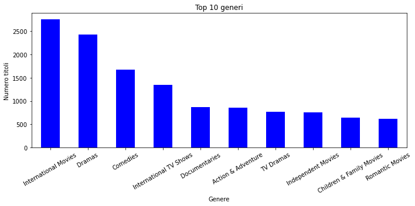
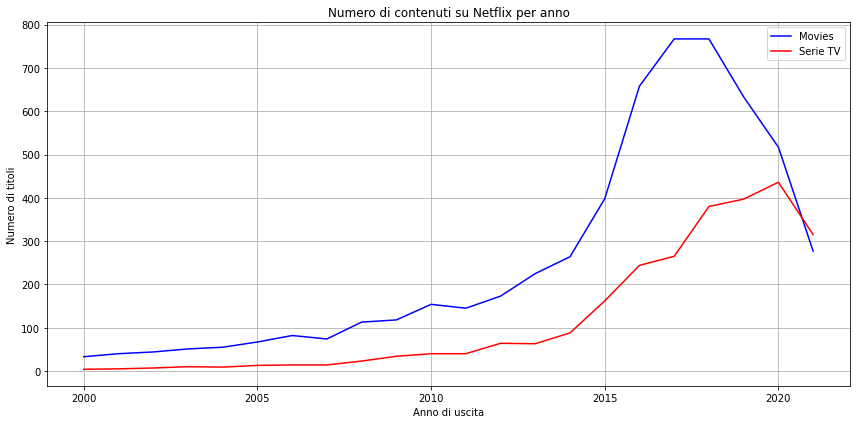
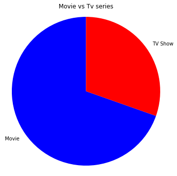

# 📊 Analisi del catalogo Netflix

Questo è un progetto di analisi esplorativa dei dati del catalogo Netflix.
Ho analizzato:
- i generi più frequenti
- la differenza tra Film e Serie TV
- la distribuzione dei contenuti nel tempo
- i paesi più rappresentati nel catalogo

## Tecnologie usate
- Python
- Pandas
- Matplotlib
- Jupyter Notebook

## Come usare il progetto
1. Scaricare il file `netflix_titles.csv` da Kaggle
2. Aprire il notebook `Netflix_Analysis.ipynb` con Jupyter
3. Eseguire tutte le celle

## 🎨 Esempio di visualizzazione

📊 **Top 10 generi più presenti nel catalogo Netflix**

📊 **Andamento annuale del rilascio di nuovi titoli**

📊 **Confronto tra Film e Serie Tv**

## 📌 Conclusioni

- Il catalogo Netflix è dominato da film drammatici e documentari
- Gli USA producono la maggior parte dei contenuti
- Negli ultimi anni c’è stato un boom nei contenuti internazionali, che si è ridotto con l'arrivo del covid

Il progetto è stato realizzato come esercizio personale di analisi dati.
